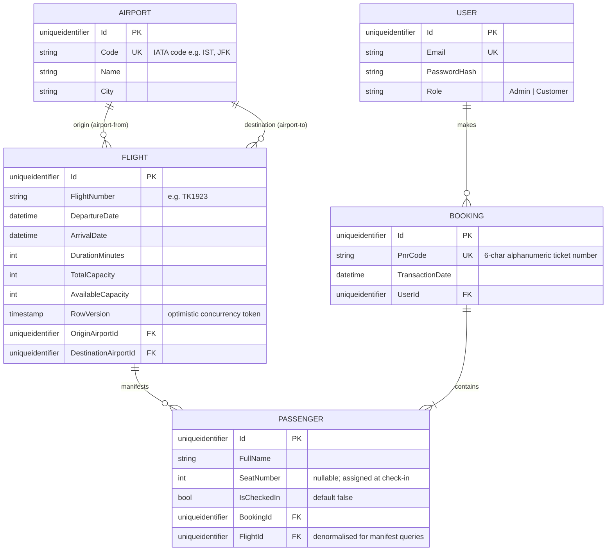

# Airline Company API

**Author:** Demir Demirdogen — SE4458 Software Architecture & Design of Modern Large Scale Systems, Midterm


A RESTful backend for an airline ticketing system built with **.NET 8** and strict **Clean Architecture**. The system handles flight inventory management, atomic ticket purchasing with seat reservation, sequential passenger check-in, and role-based access control for Admin, Customer, and Guest actors.


## Table of Contents

- [Tech Stack](#tech-stack)
- [Architecture](#architecture)
- [Data Model](#data-model)
- [API Endpoints](#api-endpoints)
- [Assumptions](#assumptions)
- [Issues Encountered](#issues-encountered)
- [Load Test Results](#load-test-results)
- [Setup Instructions](#setup-instructions)
- [Running Tests](#running-tests)


## Quick Links

| Resource | URL |
|---|---|
| Deployed Swagger UI | http://35.170.75.61:5000/swagger/index.html |
| Project Presentation | <!-- TODO: add YouTube or Google Drive link --> |
| Assumptions Document | [docs/assumptions.md](docs/assumptions.md) |
| QA & Load Test Report | [docs/Quality-Assurance-Report.md](docs/Quality-Assurance-Report.md) |


## Tech Stack

| Concern | Technology |
|---|---|
| Framework | .NET 8 Web API |
| Architecture | Clean Architecture (4-layer) |
| Database | MySQL 8+ |
| ORM | Entity Framework Core 8 + Pomelo.EntityFrameworkCore.MySql |
| Authentication | JWT Bearer (HS256) |
| API Gateway | Ocelot + MMLib.SwaggerForOcelot |
| API Documentation | Swagger / OpenAPI (Swashbuckle) |
| Unit Tests | xUnit + Moq + FluentAssertions |
| Integration Tests | xUnit + WebApplicationFactory + EF Core InMemory |
| Load Testing | k6 + InfluxDB 1.8 + Grafana |
| CI/CD | GitHub Actions |
| Cloud | AWS EC2 + Amazon ECR |
| Containerisation | Docker + Docker Compose |


## Architecture

### Layer Structure

```
src/
  AirlineSystem.Domain/         # Entities, enums, repository interfaces — zero external dependencies
  AirlineSystem.Application/    # DTOs, service interfaces, business logic orchestration
  AirlineSystem.Infrastructure/ # EF Core DbContext, repository implementations, JWT
  AirlineSystem.API/            # Controllers, middleware, DI composition root
  AirlineSystem.Gateway/        # Ocelot API Gateway — rate limiting, Swagger aggregation, port 5000

tests/
  AirlineSystem.Application.Tests/    # 25 unit tests (xUnit + Moq)
  AirlineSystem.API.IntegrationTests/ # 56 integration tests (WebApplicationFactory + InMemory)
```

**Dependency rule:** each layer references only the layer directly below it. The API project additionally references Infrastructure for DI wiring only. `DbContext` and all EF Core queries are strictly confined to Infrastructure.

### Key Design Decisions

| Decision | Detail |
|---|---|
| Round-trip booking | Buy Ticket handles one leg at a time. The client calls the endpoint twice for round trips. No multi-leg transaction. |
| `Passenger.FlightId` | Intentional denormalization — a direct FK to Flight enables efficient manifest queries without joining through Booking. |
| Atomic seat reservation | `Flight.AvailableCapacity` uses a `RowVersion` optimistic concurrency token. `DbUpdateConcurrencyException` on conflict is caught and surfaced as "SoldOut" rather than an unhandled 500. |
| Check-in input | Accepts `PnrCode` + `PassengerName` (not `FlightNumber` + `Date` + `Name`) to prevent name-guessing attacks on other passengers' bookings. |
| Seat numbering | Sequential integers starting at 1, scoped per flight, assigned as `MAX(SeatNumber) + 1` at check-in time. |
| `UserRole` as string | Stored as its string name in MySQL (`.HasConversion<string>()`) to avoid silent bugs on enum reordering. |
| CSV duration validation | Import asserts `(ArrivalDate - DepartureDate).TotalMinutes == DurationMinutes` to catch inconsistent source data. |
| Rate limiting | Max 3 flight search requests per day per client IP, enforced at the Ocelot Gateway layer on `GET /flights/search` only. |
| Airport normalization | Airports are a first-class entity with IATA code, name, and city. Flights reference airports by FK rather than storing free-text strings. |
| Admin seeding | The public `/auth/register` endpoint creates Customer-role accounts only. Admin accounts are seeded directly into the database. |

---

## Data Model

The schema is designed to Third Normal Form (3NF). A composite index on `(FlightNumber, DepartureDate)` covers the two highest-frequency queries: flight search and check-in lookups.



Full field-level documentation, normalization rationale, and concurrency strategy are in [docs/db_schema.md](docs/db_schema.md).


## API Endpoints

All routes are versioned under `/api/v1/`. The gateway (port 5000) proxies all traffic to the core API and aggregates the Swagger UI.

| Method | Route | Auth | Paging | Description |
|---|---|---|---|---|
| POST | `/api/v1/auth/register` | Public | No | Customer self-registration |
| POST | `/api/v1/auth/login` | Public | No | Returns JWT |
| GET | `/api/v1/airports` | Admin | No | List all airports |
| POST | `/api/v1/airports` | Admin | No | Create airport |
| GET | `/api/v1/airports/{id}` | Admin | No | Get airport by ID |
| PUT | `/api/v1/airports/{id}` | Admin | No | Update airport |
| DELETE | `/api/v1/airports/{id}` | Admin | No | Delete airport |
| POST | `/api/v1/airports/batch` | Admin | No | Bulk airport creation (insert-ignore semantics — duplicates skipped, not rejected) |
| GET | `/api/v1/flights` | Admin | No | List all flights |
| POST | `/api/v1/flights` | Admin | No | Create individual flight |
| GET | `/api/v1/flights/{id}` | Admin | No | Get flight by ID |
| PUT | `/api/v1/flights/{id}` | Admin | No | Update flight |
| DELETE | `/api/v1/flights/{id}` | Admin | No | Delete flight |
| POST | `/api/v1/flights/upload` | Admin | No | CSV bulk import |
| GET | `/api/v1/flights/search` | Public | Yes (10) | Rate-limited flight search |
| POST | `/api/v1/tickets/purchase` | Customer | No | Atomic ticket purchase |
| POST | `/api/v1/checkin` | Public | No | Sequential seat assignment |
| GET | `/api/v1/flights/{flightNo}/date/{date}/passengers` | Admin | Yes (10) | Passenger manifest |

---

## Assumptions

Where the specification was silent or ambiguous, explicit decisions were made and documented. A full list of 20 documented assumptions with rationale is in **[docs/assumptions.md](docs/assumptions.md)**.

The most significant assumptions are:

- **Check-in** uses `PnrCode + PassengerName` (not `FlightNumber + Date + Name`) to prevent unauthorized check-ins.
- **Sold-out exclusion** triggers when `AvailableCapacity < numberOfPeople`, not only at zero capacity.
- **Round-trip booking** is two separate single-leg Purchase calls; no combined transaction.
- **Admin accounts** cannot be self-registered; they must be seeded directly into the database.
- **No payment processing** — a confirmed capacity decrement constitutes a successful booking.


## Issues Encountered

### 1. Unhandled Optimistic Concurrency Exceptions

EF Core raises `DbUpdateConcurrencyException` when two concurrent ticket purchases read the same `RowVersion` and both attempt to commit. Initially this leaked as an unhandled HTTP 500. The fix was catching the exception in `TicketService` and returning a `SoldOut` result. Under sustained load (Concurrency Bomb scenario at 25 concurrent writers) the check rate for `purchase: no server error` still fell below the 0.90 threshold, indicating the retry loop requires further hardening.

### 2. BCrypt CPU Saturation Under High Concurrency

At 100 virtual users, the Auth Flood scenario (register + login in sequence) saturated the thread pool with BCrypt work (~150 ms CPU per hash at cost factor 10). This queued requests from unrelated endpoints and caused latency spikes across the board. A dedicated BCrypt worker queue or a gateway-level rate limit on `POST /auth/register` would mitigate this.

### 3. Rate Limit IP Detection Behind Docker

Ocelot's built-in `ClientIpAddress` resolution did not correctly extract the originating IP when the gateway and core API were running as Docker containers on the same bridge network. The gateway was receiving the Docker internal IP of the API container instead of the real client IP. The fix was to read the `X-Forwarded-For` header and fall back to `HttpContext.Connection.RemoteIpAddress`, injecting a `ClientId` header that the downstream rate-limit middleware could trust.

### 4. Docker Port Mismatches

Multiple iterations were needed to align port mappings across Dockerfiles (`EXPOSE 8080`), `docker-compose.yml` service definitions, Ocelot downstream configuration, and the EC2 security group ingress rules. The gateway exposes port 5000 externally; both application containers listen on 8080 internally.

### 5. SwaggerForOcelot Downstream URL

MMLib.SwaggerForOcelot requires an explicit host:port in the downstream URL to correctly proxy the `swagger.json` from the core API. Omitting the port caused the aggregation to fail silently, showing an empty Swagger UI at the gateway.

### 6. Azure to AWS Migration

The project was initially deployed to Azure App Service (Sweden Central, B1 plan, ACR). Azure for Students subscription credit constraints and the inability to control raw port mappings on the App Service tier required migration to AWS EC2 with Docker Compose. The EC2 deployment gives full control over networking and is substantially cheaper for a containerised workload of this size.

### 7. EF Core InMemory Database Isolation in Integration Tests

Placing `Guid.NewGuid()` inside the `AddDbContext` lambda in `CustomWebApplicationFactory` caused every HTTP request during a test to receive a fresh empty in-memory database instead of the shared test database. The fix was to capture the database name in a variable outside the lambda: `var dbName = $"TestDb_{Guid.NewGuid()}";` and reference it from inside the lambda.


## Load Test Results

The load test is implemented in `load-tests/script.js` using k6 and targets 7 chaos scenarios at up to 100 concurrent virtual users over 3 minutes 30 seconds. Metrics are stored in InfluxDB 1.8 and visualised in Grafana (Dashboard ID 10660).

### Load Profile

| Stage | Duration | VUs |
|---|---|---|
| Ramp-up | 0 – 45 s | 0 → 50 |
| Peak (Chaos Zone) | 45 s – 2 m 45 s | 50 → 100 |
| Ramp-down | 2 m 45 s – 3 m 30 s | 100 → 0 |

### Endpoints Tested

| Scenario | Weight | Endpoint(s) | Bottleneck Targeted |
|---|---|---|---|
| Concurrency Bomb | 25% | `POST /tickets/purchase` | RowVersion optimistic concurrency — unhandled 500s |
| Stale Scan | 15% | `GET /flights/search` | Ghost routes + wide 30–90 day windows — full index scans |
| Thundering Herd | 15% | `POST /checkin` | Same PNR from all VUs — `MAX(SeatNumber)` race condition |
| Inventory Cliff | 15% | `POST /tickets/purchase` | `AvailableCapacity = 0` transition — 15 writers vs 10 seats |
| Auth Flood | 10% | `POST /auth/register` + `POST /auth/login` | Back-to-back BCrypt CPU saturation |
| Deep Pagination | 10% | `GET /passengers` + `GET /flights/search` | High-OFFSET queries on large result sets |
| CSV Bomb | 10% | `POST /flights/upload` | 25-row multipart payloads with intentional duplicate keys |

### Thresholds

| Threshold | Limit | Purpose |
|---|---|---|
| `http_req_failed` | `rate < 0.10` | Global error cap — 10% tolerance for intentional concurrency failures |
| `http_req_duration` | `p(95) < 3000 ms` | 95th percentile must stay under 3 s at 100 VUs |
| `checks{purchase: no server error}` | `rate > 0.90` | Concurrency detector — below 0.90 means `DbUpdateConcurrencyException` leaks as 500 |
| `checks{auth register: 201}` | `rate > 0.95` | BCrypt correctness gate — registration must succeed under CPU saturation |

### Summary Metrics

| Metric | Value |
|---|---|
| Total HTTP requests | 11,700+ |
| Peak throughput | ~150 requests / second |
| Test duration | 3 minutes 30 seconds |
| Maximum virtual users | 100 |
| p95 response time | *(screenshot pending — see `docs/screenshots/grafana-duration.png`)* |
| Overall error rate | *(screenshot pending — see `docs/screenshots/grafana-errors.png`)* |

### Key Findings

- **Performance under load:** The API handled high read traffic well — flight search and pagination queries stayed within the p95 latency target across all scenarios. Concurrent heavy writes struggled: the `purchase: no server error` check rate fell below the 0.90 threshold during peak chaos, and BCrypt-heavy auth registration caused latency spikes that cascaded to other endpoints at 100 VUs.

- **Observed bottlenecks:** EF Core's RowVersion optimistic concurrency on `Flight.AvailableCapacity` produced unhandled `DbUpdateConcurrencyException` HTTP 500 errors during concurrent ticket purchases (Concurrency Bomb and Inventory Cliff scenarios). BCrypt CPU saturation during Auth Flood (~300 ms per VU iteration at cost factor 10) caused thread-pool queuing that degraded response times across the board.

- **Potential scalability improvements:** Implement Redis caching on `GET /flights/search` results (TTL 60 s) to eliminate repeated full-index scans for identical or ghost-route queries. Replace synchronous `AvailableCapacity` decrements with a RabbitMQ-backed async purchase queue to serialize ticket writes without RowVersion contention, converting Concurrency Bomb failures into graceful queued confirmations.

Grafana dashboard screenshots and the full scenario-by-scenario breakdown are in [docs/Quality-Assurance-Report.md](docs/Quality-Assurance-Report.md).

### Running the Load Test

**Prerequisites:** Docker running (for InfluxDB + Grafana), k6 installed, MySQL running with migrations applied.

```bash
# Start the observability stack
docker compose up -d

# Start the core API
dotnet run --project src/AirlineSystem.API

# Run k6 (PowerShell)
k6 run `
  -e K6_ADMIN_EMAIL=YOUR_ADMIN_EMAIL `
  -e K6_ADMIN_PASSWORD=YOUR_ADMIN_PASSWORD `
  -e BASE_URL=http://localhost:5203 `
  --tag application=airline-api `
  --out influxdb=http://localhost:8086/k6 `
  load-tests/script.js
```

> k6 has no `--env-file` flag — environment variables must be passed individually with `-e KEY=VALUE`.
>
> `--tag application=airline-api` is required. Dashboard 10660 filters all top panels on this tag; without it every panel shows "No Data".


## Setup Instructions

### Prerequisites

- [.NET 8 SDK](https://dotnet.microsoft.com/download/dotnet/8.0)
- MySQL 8+ (local or remote)
- `dotnet-ef` global tool: `dotnet tool install --global dotnet-ef`

### 1. Clone and Configure

```bash
git clone <repo-url>
cd Airline-API-dotnet
```

Create `src/AirlineSystem.API/appsettings.Development.json` (this file is gitignored):

```json
{
  "ConnectionStrings": {
    "DefaultConnection": "Server=localhost;Port=3306;Database=AirlineSystemDb_Dev;User=root;Password=YOUR_PASSWORD;"
  },
  "JwtSettings": {
    "Secret": "your-secret-key-minimum-32-characters"
  }
}
```

### 2. Apply Migrations

```bash
dotnet ef database update \
  --project src/AirlineSystem.Infrastructure \
  --startup-project src/AirlineSystem.API
```

### 3. Run the API

```bash
# Core API — http://localhost:5203, Swagger at /swagger
dotnet run --project src/AirlineSystem.API

# Gateway — http://localhost:5000, aggregated Swagger at /swagger
dotnet run --project src/AirlineSystem.Gateway
```

### Docker (full stack)

Create a `.env` file at the solution root:

```
JWT_SECRET=your-secret-key-minimum-32-characters
MYSQL_PASSWORD=your-mysql-password
```

```bash
docker compose up -d
```

Gateway will be available at `http://localhost:5000/swagger`.

---

## Running Tests

```bash
# All tests (25 unit + 56 integration = 81 total)
dotnet test --configuration Release

# Unit tests only
dotnet test tests/AirlineSystem.Application.Tests --configuration Release

# Integration tests only
dotnet test tests/AirlineSystem.API.IntegrationTests --configuration Release
```

No MySQL connection or secrets are required — integration tests substitute the real database with EF Core InMemory. All 81 tests run in approximately 41 seconds on a standard CI runner.


## Project Documentation

| File | Contents |
|---|---|
| [docs/reqs.md](docs/reqs.md) | Functional and non-functional requirements (SRS) |
| [docs/business_specification.md](docs/business_specification.md) | Business processes, step-by-step operational logic, estimated endpoints |
| [docs/db_schema.md](docs/db_schema.md) | ER diagram, normalization strategy, concurrency and indexing details |
| [docs/assumptions.md](docs/assumptions.md) | All 20 documented assumptions with rationale |
| [docs/Quality-Assurance-Report.md](docs/Quality-Assurance-Report.md) | Full QA report: unit tests, integration tests, load test scenarios and analysis |
