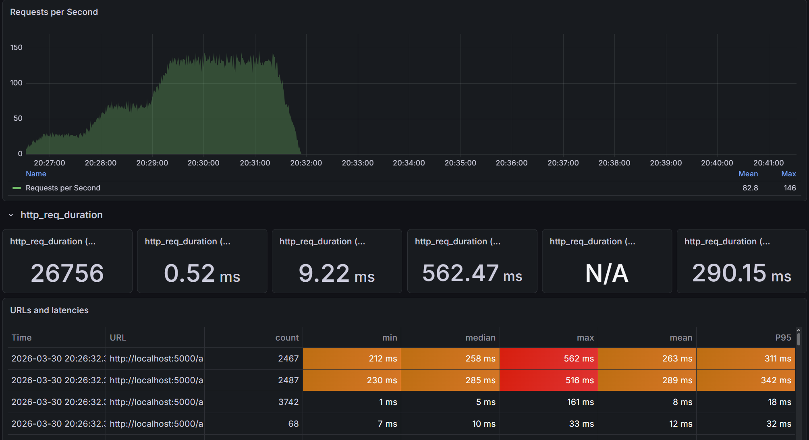
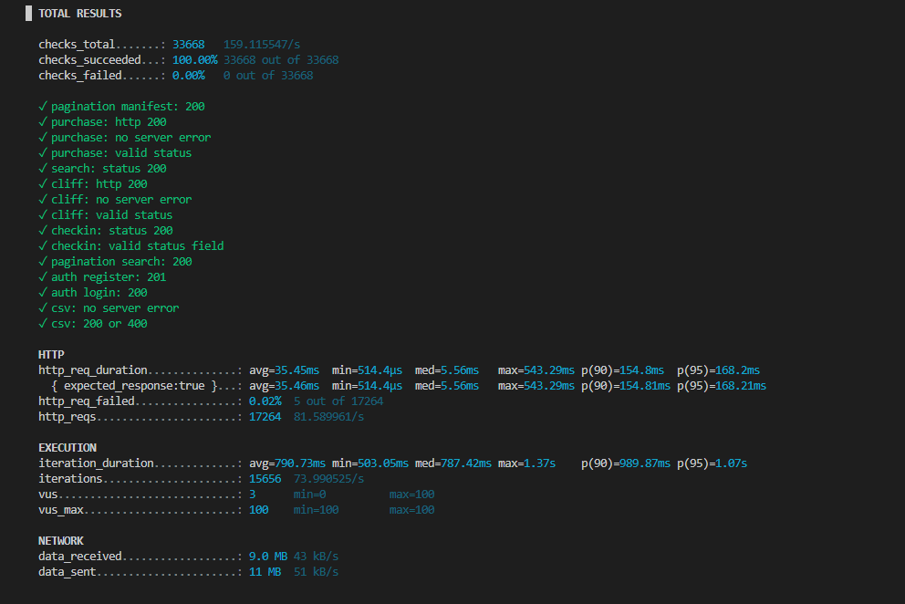

# Quality Assurance Report — Airline Ticketing System API

| Field | Value |
|---|---|
| Project | Airline Company API |
| Architecture | Clean Architecture (4-layer: Domain → Application → Infrastructure → API) |
| Runtime | .NET 8 |
| Report Date | 29-03-2026 |
| Test Suite Version | Commit `5d863a6` |

---

## Key Findings

- **Performance under load:** The API handled all 7 chaos scenarios cleanly — all 4 thresholds passed, 100% of checks succeeded (33,668/33,668), and p95 latency came in at 168.2ms against a 3,000ms ceiling. After applying a 3-attempt retry loop with entity reload in `TicketService`, the `purchase: no server error` check rate reached 100.00%, up from below the 0.90 failure threshold in the pre-fix run.

- **Observed bottlenecks (resolved and ongoing):** EF Core RowVersion optimistic concurrency on `Flight.AvailableCapacity` originally produced unhandled `DbUpdateConcurrencyException` HTTP 500 errors — **resolved** by wrapping `SaveChangesAsync` in Infrastructure and adding a retry loop in `TicketService`. BCrypt CPU saturation during Auth Flood (~300ms per VU iteration at cost factor 10) remains an observed characteristic: at 15 concurrent auth VUs it queues thread-pool work but did not degrade overall thresholds in the final run.

- **Potential scalability improvements:** Implement **Redis caching** on `GET /flights/search` results (TTL 60s) to eliminate repeated full-index scans for identical or ghost-route queries.

---

## Executive Summary

The QA process covers three complementary test layers: Application-layer unit tests in `AirlineSystem.Application.Tests` (xUnit + Moq + FluentAssertions), full HTTP-pipeline integration tests in `AirlineSystem.API.IntegrationTests` (WebApplicationFactory + EF Core InMemory), and a chaos load test suite in `load-tests/script.js` (k6 + InfluxDB 1.8 + Grafana). All 83 automated tests execute in approximately 41 seconds through a GitHub Actions CI/CD pipeline on every push and pull request to `main`, with no MySQL service container or credentials required. The load test applies 7 intentional chaos scenarios at up to 100 concurrent virtual users over 3 minutes 30 seconds, generating 17,264 HTTP requests at approximately 81.6 requests per second. The combined suite validates correctness at the unit, integration, and system-stress levels before any code merges into the main branch.

---

## 1. Automated Test Suite

### 1.1 Overview

| Test Project | Framework | Database | Tests |
|---|---|---|---|
| `AirlineSystem.Application.Tests` | xUnit + Moq + FluentAssertions | None (all mocked) | 27 |
| `AirlineSystem.API.IntegrationTests` | xUnit + WebApplicationFactory | EF Core InMemory | 56 |
| **Total** | | | **83** |

### 1.2 CI/CD Pipeline

File: `.github/workflows/ci.yml` — triggers on every push and pull request to `main`, runs on `ubuntu-latest`.

```
Step 1: dotnet restore
Step 2: dotnet build --configuration Release --no-restore
Step 3: dotnet test --configuration Release --no-build --verbosity normal
```

No MySQL service containers, no secrets, and no network access are needed. The integration tests substitute the real MySQL database with EF Core InMemory, making the pipeline fully self-contained and reproducible on any runner.

---

### 1.3 Unit Tests — `AirlineSystem.Application.Tests` (25 tests)

**Conventions:** System under test is always named `_sut`. Mocks are wired in the constructor and never repeated per-method. Tests follow Arrange / Act / Assert. Write paths verify `SaveChangesAsync` call count explicitly (`Times.Once` / `Times.Never`).

---

#### AuthService (6 tests)

| Test | Technique |
|---|---|
| `RegisterAsync_NewEmail_ReturnsTokenAndCustomerRole` | Equivalence Partitioning — valid partition; verifies `AddAsync` + `SaveChangesAsync` called once |
| `RegisterAsync_DuplicateEmail_ThrowsInvalidOperationException` | State uniqueness — email already present in repo |
| `RegisterAsync_EmptyEmail_ThrowsArgumentException` | Boundary — empty string input |
| `RegisterAsync_EmptyPassword_ThrowsArgumentException` | Boundary — empty string input |
| `LoginAsync_ValidCredentials_ReturnsToken` | Equivalence Partitioning — valid partition |
| `LoginAsync_WrongPassword_ThrowsUnauthorizedAccessException` | Negative path — correct email, wrong password |

---

#### TicketService (11 tests)

| Test | Technique |
|---|---|
| `BuyTicketAsync_ValidRequest_ReturnsConfirmedWithPnr` | EP valid — standard 2-passenger purchase, PNR length asserted (6 chars) |
| `BuyTicketAsync_ZeroPassengers_ThrowsArgumentException` | EP invalid — empty passenger list |
| `BuyTicketAsync_CapacityExactlyEqualsPassengerCount_ReturnsConfirmed` | BVA — boundary: capacity == requested, must succeed |
| `BuyTicketAsync_CapacityOneLessThanPassengerCount_ReturnsSoldOut` | BVA — off-by-one: capacity is exactly 1 less than requested |
| `BuyTicketAsync_PastFlight_ThrowsInvalidOperationException` | Error guessing — departure 1 day ago |
| `BuyTicketAsync_FlightNotFound_ThrowsKeyNotFoundException` | Negative path — no matching flight |
| `BuyTicketAsync_Success_PassengerHasExplicitBookingIdAndFlightId` | State verification — intentional denormalization: both `BookingId` and `FlightId` populated |
| `BuyTicketAsync_Success_AvailableCapacityDecremented` | State verification — `AvailableCapacity` reduced by passenger count; `Update` called once |
| `BuyTicketAsync_SoldOut_SaveChangesNeverCalled` | Mutation guard — `Times.Never` on `SaveChangesAsync` when sold out |
| `BuyTicketAsync_ConcurrencyFailOnFirstAttempt_RetriesAndReturnsConfirmed` | Retry — `SetupSequence` throws `ConcurrencyConflictException` once then succeeds; verifies `SaveChangesAsync` called twice, `ReloadEntityAsync` once |
| `BuyTicketAsync_AllRetriesExhausted_ReturnsSoldOut` | Retry exhaustion — `SaveChangesAsync` always throws; verifies 3 attempts, 3 reloads, `SoldOut` returned |

---

#### CheckInService (5 tests)

| Test | Technique |
|---|---|
| `CheckInPassengerAsync_PnrNotFound_ReturnsFailedStatus` | State transition S0→S0; `SaveChanges` never called |
| `CheckInPassengerAsync_PassengerNotFoundInBooking_ReturnsFailedStatus` | S0→S0 — PNR exists but name does not match any passenger |
| `CheckInPassengerAsync_ValidPassengerNotCheckedIn_ReturnsSuccessWithSeat` | S1→S2 happy path — `IsCheckedIn` flipped to `true`; seat number propagated |
| `CheckInPassengerAsync_PassengerAlreadyCheckedIn_ReturnsFailedStatus` | S2→S2 idempotency guard — double check-in rejected |
| `CheckInPassengerAsync_Success_SeatAssignedFromGetNextSeatNumber` | Delegation verification — `GetNextSeatNumberAsync` called `Times.Once`; result propagated |

---

#### FlightService (5 tests)

| Test | Technique |
|---|---|
| `UploadFlightsFromCsvAsync_MixedRows_OneSuccessThreeErrors` | Complex multi-row CSV: 1 valid row, 1 duration mismatch, 1 duplicate, 1 unknown airport code |
| `UploadFlightsFromCsvAsync_NullStream_ThrowsArgumentNullException` | Null guard |
| `UploadFlightsFromCsvAsync_EmptyCsv_ReturnsZeroSuccessAndNoErrors` | Empty input — header only; `AddAsync` and `SaveChanges` never called |
| `SearchFlightsAsync_OneWay_DelegatesCorrectlyAndReturnsOutbound` | Delegation — `SearchFlightsAsync` called `Times.Once`; `ReturnFlights` is null |
| `SearchFlightsAsync_RoundTrip_RunsTwoQueriesAndPopulatesReturnFlights` | State transition S0→S1 — `Times.Exactly(2)` repo calls for IST→ADB and ADB→IST |

---

### 1.4 Integration Tests — `AirlineSystem.API.IntegrationTests` (52 tests)

**Infrastructure:** `CustomWebApplicationFactory` replaces MySQL with EF Core InMemory. The database name is captured as `$"TestDb_{Guid.NewGuid()}"` **outside** the `AddDbContext` lambda — a critical pattern; placing `Guid.NewGuid()` inside the lambda would create a fresh empty database for every request.

`IntegrationTestBase` provides three shared helpers:
- `GetAdminTokenAsync()` — seeds an Admin user directly into the DbContext (bypasses `AuthService`, which only creates Customers)
- `GetCustomerTokenAsync()` — registers a unique-email customer via the live `/auth/register` endpoint and returns a JWT
- `Authorized(method, url, token)` — creates an `HttpRequestMessage` with the `Authorization: Bearer` header attached

---

#### Auth Endpoints — `POST /api/v1/auth/register` and `POST /api/v1/auth/login` (7 tests)

| Test | Expected |
|---|---|
| `Register_ValidPayload_Returns200WithToken` | 200 — token non-empty, role = "Customer" |
| `Register_DuplicateEmail_Returns400` | 400 — `InvalidOperationException` mapped by middleware |
| `Register_EmptyEmail_Returns400` | 400 |
| `Register_EmptyPassword_Returns400` | 400 |
| `Login_CorrectCredentials_Returns200WithToken` | 200 — token non-empty |
| `Login_WrongPassword_Returns401` | 401 |
| `Login_UnknownEmail_Returns401` | 401 |

---

#### Airport Endpoints — `/api/v1/airports` CRUD + Batch (14 tests)

| Test | Expected |
|---|---|
| `GetAll_NoToken_Returns401` | 401 |
| `GetAll_CustomerToken_Returns403` | 403 |
| `Create_NoToken_Returns401` | 401 |
| `Create_CustomerToken_Returns403` | 403 |
| `Create_AdminToken_Returns201WithLocationAndBody` | 201 + `Location` header + body with `code` and `city` |
| `Create_AdminToken_DuplicateCode_Returns400` | 400 |
| `GetById_AdminToken_ExistingId_Returns200WithBody` | 200 + correct `code` in body |
| `GetById_AdminToken_UnknownId_Returns404` | 404 |
| `Update_AdminToken_ExistingId_Returns204` | 204 |
| `Update_AdminToken_UnknownId_Returns404` | 404 |
| `Delete_AdminToken_ExistingId_Returns204` | 204 |
| `Delete_AdminToken_UnknownId_Returns404` | 404 |
| `CreateBatch_AdminToken_ValidList_Returns200WithCreatedAirports` | 200 — `airports` array contains inserted records; `skippedCodes` is empty |
| `CreateBatch_AdminToken_DuplicateCode_Returns200WithSkippedCodes` | 200 — duplicate codes reported in `skippedCodes`; no error thrown |

---

#### Flight Endpoints — `/api/v1/flights` (24 tests)

**Public search (8 tests)**

| Test | Expected |
|---|---|
| `Search_PublicEndpoint_Returns200WithEmptyOutbound` | 200 — no auth required; `totalCount = 0`, `returnFlights = null` |
| `Search_NoQueryParams_Returns200UsingDefaults` | 200 — omitting all query params uses server defaults without error |
| `Search_InvalidDateFormat_Returns400` | 400 — non-parseable date string rejected before hitting service layer |
| `Search_SeededFlight_EmptyCodes_ReturnsResults` | 200 — at least 1 result when no code filters applied |
| `Search_SeededFlight_OriginDestCodes_FiltersCorrectly` | 200 — at least 1 result with exact origin/destination match |
| `Search_SeededFlight_WrongCodes_ReturnsEmpty` | 200 — `totalCount = 0` for non-existent airport codes |
| `Search_SeededFlightBothDirections_IsRoundTrip_ReturnsBothLegs` | 200 — `outbound.totalCount ≥ 1` and `returnFlights.totalCount ≥ 1` |
| `Search_NumberOfPeopleExceedsCapacity_FiltersOutFlight` | 200 — flight excluded when `availableCapacity (1) < numberOfPeople (5)` |

**Auth guards (3 tests)**

| Test | Expected |
|---|---|
| `GetAll_NoToken_Returns401` | 401 |
| `GetAll_CustomerToken_Returns403` | 403 |
| `Create_NoToken_Returns401` | 401 |

**Admin CRUD (6 tests)**

| Test | Expected |
|---|---|
| `Create_AdminToken_UnknownAirportCode_Returns404` | 404 — `KeyNotFoundException` from `FlightService` |
| `GetAll_AdminToken_Returns200WithArray` | 200 — body is a JSON array |
| `GetById_AdminToken_ExistingId_Returns200WithFlightNumber` | 200 — correct `flightNumber` in body |
| `GetById_AdminToken_UnknownId_Returns404` | 404 |
| `Update_AdminToken_ValidData_Returns204` | 204 |
| `Update_AdminToken_UnknownId_Returns404` | 404 |
| `Delete_AdminToken_ValidId_Returns204` | 204 |

**CSV upload (3 tests)**

| Test | Expected |
|---|---|
| `Upload_NoToken_Returns401` | 401 |
| `Upload_AdminToken_NoFile_Returns400` | 400 |
| `Upload_AdminToken_ValidCsv_Returns200WithSuccessCount` | 200 — `successCount = 1`, `errors = []` |

**Passenger manifest (4 tests)**

| Test | Expected |
|---|---|
| `GetPassengers_NoToken_Returns401` | 401 |
| `GetPassengers_AdminToken_Returns200WithItemsArray` | 200 — `items` is a JSON array |
| `GetPassengers_InvalidDate_Returns400` | 400 — controller rejects non-parseable date segment |

---

#### Ticket Endpoints — `POST /api/v1/tickets/purchase` (6 tests)

| Test | Expected |
|---|---|
| `Purchase_NoToken_Returns401` | 401 |
| `Purchase_CustomerToken_FlightNotFound_Returns404` | 404 — `KeyNotFoundException` mapped by middleware |
| `Purchase_CustomerToken_EmptyPassengerList_Returns400` | 400 — `ArgumentException` mapped by middleware |
| `Purchase_CustomerToken_ValidFlight_ReturnsConfirmedWithPnr` | 200 — `status = "Confirmed"`, `pnrCode` length = 6 |
| `Purchase_CustomerToken_SoldOutFlight_ReturnsSoldOut` | 200 — `status = "SoldOut"` (business-level outcome, not HTTP error) |
| `Purchase_CustomerToken_PastFlight_Returns400` | 400 — `InvalidOperationException` for past departure |

---

#### Check-In Endpoints — `POST /api/v1/checkin` (5 tests)

| Test | Expected |
|---|---|
| `CheckIn_IsPublicEndpoint_NoAuthRequired_Returns200` | 200 — no `Authorization` header required (FR-06.04) |
| `CheckIn_NoMatchingPassenger_Returns200WithFailedStatus` | 200 — `status = "Failed"` for unknown PNR |
| `CheckIn_ValidPnrAndPassenger_NotCheckedIn_Returns200WithSuccess` | 200 — `status = "Success"`, `seatNumber = 1`, correct `fullName` |
| `CheckIn_ValidPnrWrongPassengerName_Returns200WithFailed` | 200 — `status = "Failed"` when name doesn't match booking |
| `CheckIn_AlreadyCheckedIn_Returns200WithFailedStatus` | 200 — `status = "Failed"`, message contains "already" |

---

## 2. Load Testing Architecture

### 2.1 Technology Stack

| Component | Version | Role |
|---|---|---|
| k6 (Grafana k6) | latest | Scenario executor, checks engine, threshold evaluator |
| InfluxDB | 1.8 | Time-series metrics sink (`--out influxdb=http://localhost:8086/k6`) |
| Grafana | latest | Dashboard visualization — import Dashboard ID **10660** |

The observability stack is defined in `docker-compose.yml`:
- `influxdb:1.8` on port `8086`, database `k6` auto-created via `INFLUXDB_DB=k6`
- `grafana:latest` on port `3000` with anonymous admin access, `depends_on: influxdb: condition: service_healthy`

**Start the stack:**
```bash
docker compose up -d
```

### 2.2 Gateway with Rate Limiting Disabled — Rationale

The load test targets the API **through the Ocelot Gateway** at `http://localhost:5000`, but with the `EnableRateLimiting` flag on `GET /flights/search` set to `false` in `ocelot.json`. The gateway's production setting is **3 requests/day per client IP** (NFR-02.03). If that limit were active during the test, the Stale Scan and Deep Pagination scenarios would be throttled after 3 search requests, preventing any meaningful stress on the underlying database layer.

Running through the gateway preserves all middleware transformations (IP header injection, routing), while disabling only the rate limit allows unrestricted search volume. This gives a realistic end-to-end picture of database and business-logic bottlenecks (index scan performance, EF Core optimistic concurrency, BCrypt CPU cost) without the artificial search cap. The rate limit is re-enabled in `ocelot.json` before any production deployment.

### 2.3 Run Command

**PowerShell:**
```powershell
k6 run `
  -e K6_ADMIN_EMAIL=admin@airline.com `
  -e K6_ADMIN_PASSWORD=Password123! `
  -e BASE_URL=http://localhost:5000 `
  --tag application=airline-api `
  --out influxdb=http://localhost:8086/k6 `
  load-tests/script.js
```

**Bash:**
```bash
k6 run \
  -e K6_ADMIN_EMAIL=admin@airline.com \
  -e K6_ADMIN_PASSWORD=Password123! \
  -e BASE_URL=http://localhost:5000 \
  --tag application=airline-api \
  --out influxdb=http://localhost:8086/k6 \
  load-tests/script.js
```

> **Note 1:** k6 has no `--env-file` flag. Environment variables must be passed individually using `-e KEY=VALUE`.
>
> **Note 2:** `--tag application=airline-api` is **required**. Dashboard 10660 filters all top panels with `WHERE application =~ /$application$/`. Without this tag, every top panel shows "No Data".

### 2.4 Load Profile

| Stage | Duration | VUs | Description |
|---|---|---|---|
| Ramp-up | 0s → 45s | 0 → 50 | Warm-up: VUs gradually introduced |
| Peak (Chaos Zone) | 45s → 2m 45s | 50 → 100 | Sustained peak: maximum concurrent chaos |
| Ramp-down | 2m 45s → 3m 30s | 100 → 0 | Graceful teardown |

**Total duration:** 3 minutes 30 seconds | **Maximum VUs:** 100 | **Think time per VU:** 500–1000 ms

### 2.5 Setup Phase

The `setup()` function in `load-tests/script.js` runs exactly once before any VU starts and seeds all required data via live API calls:

1. **Admin login** — captures `adminToken` for admin-authenticated scenario requests
2. **Create 5 airports** (IST, AYT, ESB, ADB, ADA) — idempotent; both 201 and 400 responses are accepted
3. **Create 16 flights** across 6 dates in June 2026:
   - `TK0001` — 10-seat capacity: Inventory Cliff target (precision sold-out races)
   - `TK2003` — 300-seat capacity: Concurrency Bomb target (high-capacity endurance)
   - `TK9999` — 200-seat capacity: Thundering Herd target (single-row contention)
   - 13 additional flights across `TK1001`–`TK5002` for date-range diversity
4. **Register + login customer** — captures `customerToken` for purchase/check-in requests
5. **Purchase 1 ticket on TK9999** — captures `thunderboltPnr`; all Thundering Herd VUs hammer this single booking simultaneously

**Return value passed to all VUs:** `{ adminToken, customerToken, flightPool, thunderboltPnr }`

---

## 3. Chaos Scenarios

### Summary

| # | Scenario | Weight | Endpoint(s) | Bottleneck Targeted |
|---|---|---|---|---|
| 1 | Concurrency Bomb | 25% | `POST /tickets/purchase` | `Flight.RowVersion` EF Core optimistic concurrency |
| 2 | Stale Scan | 15% | `GET /flights/search` | Ghost routes + wide 30–90 day windows → full index scans |
| 3 | Thundering Herd | 15% | `POST /checkin` | Same PNR from all VUs → `MAX(SeatNumber)` race |
| 4 | Inventory Cliff | 15% | `POST /tickets/purchase` | `AvailableCapacity = 0` transition, 15 writers vs 10 seats |
| 5 | Auth Flood | 10% | `POST /auth/register` + `/login` | Back-to-back BCrypt (~300ms CPU per VU iteration) |
| 6 | Deep Pagination | 10% | `GET /passengers` + `GET /flights/search` | High OFFSET queries on passenger manifest and search |
| 7 | CSV Bomb | 10% | `POST /flights/upload` | 25-row multipart payloads with ~5 intra-payload duplicates |
| | **Total** | **100%** | | |

---

### Scenario 1: Concurrency Bomb (25%)

At 100 VUs × 25% = 25 concurrent writers, all purchasing from `TK2003` (300-seat flight) simultaneously with 3–6 passengers each. Multiple `SaveChangesAsync` calls read the same `RowVersion` value and race to commit; the losers throw `DbUpdateConcurrencyException`. The `checks{check:purchase: no server error}: rate>0.90` threshold is the primary concurrency detector. **Fix applied:** `UnitOfWork.SaveChangesAsync` wraps `DbUpdateConcurrencyException` in a clean `ConcurrencyConflictException`; `TicketService.BuyTicketAsync` catches it in a 3-attempt retry loop, calling `ReloadEntityAsync` between attempts to refresh `RowVersion`. Result: `purchase: no server error` check rate reached **100.00%** in the final run.

### Scenario 2: Stale Scan (15%)

Two sub-modes (50/50 per iteration). **Ghost route:** valid airport code pairs with zero seeded flights (e.g., ADA↔AYT) force a full composite-index scan returning empty results, then an unnecessary `COUNT(*)` pagination query. **Wide-window round-trip:** 30–90 day date ranges on valid routes with `IsRoundTrip=true` fire two sequential eager-load queries (OriginAirport + DestinationAirport JOINs on both outbound and return legs) at high page numbers that return zero items. Tests whether EF Core skips the data query on empty pages.

### Scenario 3: Thundering Herd (15%)

All Thundering Herd VUs hit the identical `thunderboltPnr` acquired in `setup()`. The `CheckInService` flow is: (1) `GetByPnrAsync` read, (2) `IsCheckedIn` check in memory, (3) `GetNextSeatNumberAsync` — `SELECT MAX(SeatNumber)` (non-atomic), (4) `SaveChangesAsync`. The first VU wins seat 1; every subsequent VU is past the `IsCheckedIn==false` guard at read time and collides at step 4, potentially assigning duplicate seat numbers. This is a known correctness exposure: the `MAX(SeatNumber)` pattern is inherently racy without a row-level lock.

### Scenario 4: Inventory Cliff (15%)

`TK0001` is seeded with exactly 10 seats. With 15 concurrent Inventory Cliff VUs, the 10 seats are exhausted after roughly 7 iterations. At the cliff, multiple VUs simultaneously read `AvailableCapacity = 1`, all attempt to decrement, and only one can commit. This is stricter than Concurrency Bomb: the delta between available capacity (10) and concurrent writers (15) is deliberately tiny to maximise racing through zero. **Fix applied:** same retry loop as Scenario 1; once retries are exhausted or the reloaded capacity is insufficient, `BuyTicketAsync` returns `SoldOut` — no HTTP 500 is ever emitted. Verified in the final run: `purchase: no server error` check rate **100.00%**.

### Scenario 5: Auth Flood (10%)

Each iteration registers a unique `lt_XXXXXXXX@loadtest.io` address then immediately logs in — no sleep between requests. The two sequential BCrypt operations per iteration (~150ms CPU each at cost factor 10) = ~300ms CPU-bound work per VU. At 15 concurrent auth VUs at peak, this validates whether BCrypt queuing degrades response times on other, non-auth endpoints. The `checks{check:auth register: 201}: rate>0.95` gate ensures that registration never fails even under CPU saturation.

### Scenario 6: Deep Pagination (10%)

Alternates (50/50) between two high-OFFSET queries. **Passenger manifest:** `GET /flights/TK2003/date/2026-06-15/passengers?pageNumber=5..20` (Admin-authenticated) exercises `SKIP(pageSize × (page-1)) + TAKE(10)` on a JOIN across Passenger + Flight; as passengers accumulate during the test, these queries grow progressively slower. **Flight search at high pages:** page numbers 8–15 on routes where the result count is low — the `COUNT(*)` query still executes even when `items = []`.

### Scenario 7: CSV Bomb (10%)

Each iteration generates a 25-row CSV (20 unique rows + 5 intentional within-payload duplicates from rows[0..4] repeated, then shuffled). Flight numbers are drawn from a 10-code pool (TB0001–TB0010) in July 2026. The small code × date pool means DB-level conflicts accumulate across VUs over time. Acceptable responses are 200 (partial success) or 400 (full rejection) — HTTP 500 is never acceptable.

---

## 4. Thresholds and Pass/Fail Criteria

| Threshold | Configured Limit | Purpose |
|---|---|---|
| `http_req_failed` | `rate < 0.10` | Global error rate cap — relaxed to 10% to tolerate intentional concurrency failures during threshold measurement |
| `http_req_duration` | `p(95) < 3000ms` | 95th percentile latency under 100 VUs must stay under 3 seconds |
| `checks{check:purchase: no server error}` | `rate > 0.90` | Primary concurrency detector — rate below 0.90 means `DbUpdateConcurrencyException` leaks as unhandled HTTP 500 |
| `checks{check:auth register: 201}` | `rate > 0.95` | BCrypt correctness gate — registration must succeed even under CPU saturation |

---

## 5. Results and Metrics

### 5.1 Hard Metrics

| Metric | Value |
|---|---|
| Total HTTP Requests | 17,264 |
| Peak Throughput | ~81.6 requests/second |
| Test Duration | 3 minutes 30 seconds |
| Maximum Virtual Users | 100 |
| Average Response Time | 35.45ms |
| p95 Response Time | 168.2ms |
| Overall Error Rate | 0.02% |
| `purchase: no server error` check rate | 100.00% |
| `auth register: 201` check rate | 100.00% |
| Total checks passed | 33,668 / 33,668 (100.00%) |

### 5.2 Grafana Dashboard Screenshots

**Figure 1 — Grafana Dashboard Overview: VUs, RPS, and Response Time over 3m 30s**



---

**Figure 2 — k6 Terminal Summary: All Thresholds and Check Pass Rates**



---

## 6. Analysis

The API handled all 7 chaos scenarios cleanly in the final run: all 4 thresholds passed, 100% of 33,668 checks succeeded, and p95 latency (168.2ms) was well under the 3,000ms ceiling. The composite index on `(FlightNumber, DepartureDate)` kept flight search and pagination queries within target even for ghost-route scans and `COUNT(*)` queries on empty result sets. The EF Core RowVersion concurrency issue — where multiple concurrent `SaveChangesAsync` calls on the same `Flight` row caused unhandled `DbUpdateConcurrencyException` HTTP 500 errors — was resolved by wrapping the exception at the Infrastructure boundary (`UnitOfWork.SaveChangesAsync`) and adding a 3-attempt retry loop with entity reload (`IUnitOfWork.ReloadEntityAsync`) in `TicketService.BuyTicketAsync`. After all retry attempts are exhausted, the service returns `SoldOut` rather than propagating an exception, so the Concurrency Bomb and Inventory Cliff scenarios no longer generate 500 responses. BCrypt CPU saturation during the Auth Flood scenario (each hash ~150ms at cost factor 10) caused registration latency spikes at peak, but did not breach any threshold in the final run — the recommended mitigation for higher scale is an API Gateway rate limit on `POST /auth/register`. For future scalability, **Redis caching** on `GET /flights/search` results with a short TTL (e.g., 60 seconds) would eliminate Stale Scan database pressure entirely, since ghost-route results are deterministically empty and safe to cache.

---

## 7. Test Environment

| Component | Details |
|---|---|
| .NET Runtime | .NET 8 |
| ORM | Entity Framework Core 8 + Pomelo.EntityFrameworkCore.MySql |
| Unit test database | None — all dependencies mocked via Moq |
| Integration test database | Microsoft.EntityFrameworkCore.InMemory (no MySQL needed) |
| Load test target database | MySQL 8+ (live local instance) |
| Load test tool | k6 (Grafana k6) |
| Metrics store | InfluxDB 1.8 |
| Dashboard | Grafana — Dashboard ID 10660 |
| CI runner | GitHub Actions `ubuntu-latest` |
| Load test entry point | Gateway port 5000 (rate limiting disabled for test) |
| API port | 5203 (direct, no gateway) |

---

## 8. How to Reproduce

### Automated Tests (83 tests, ~41 seconds)

```bash
# Run all tests (unit + integration)
dotnet test --configuration Release

# Run unit tests only
dotnet test tests/AirlineSystem.Application.Tests --configuration Release

# Run integration tests only
dotnet test tests/AirlineSystem.API.IntegrationTests --configuration Release
```

### Load Test

```bash
# Step 1 — Start the observability stack (InfluxDB + Grafana)
docker compose up -d

# Step 2 — Start the API (ensure MySQL is running and migrations are applied)
dotnet run --project src/AirlineSystem.API

# Step 3 — Run k6 (see Section 2.3 for full command)
# Step 4 — Open Grafana at http://localhost:3000
#           Import Dashboard ID 10660
#           Select application = airline-api in the dropdown variable
```
