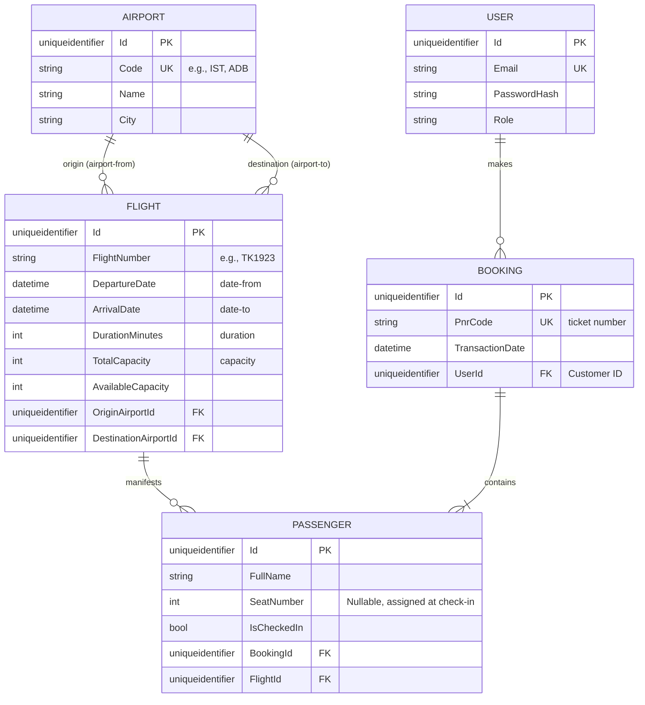

---

# Airline Company API - Database Schema (db_schema.md)

## 1. Entity Relationship (ER) Diagram
This diagram represents the normalized relational database schema designed for Entity Framework Core. It ensures data integrity and optimized querying for flight bookings.

---

## 2. Normalization & Data Types Strategy
The schema is designed up to the **Third Normal Form (3NF)** to ensure data integrity and avoid redundancy.

### 2.1 User Table (IAM)
* **Purpose:** Manages authentication and roles.
* **Fields:**
    * `Id` (Guid, PK)
    * `Email` (String, Unique): Used for login.
    * `PasswordHash` (String): Securely stored credentials.
    * `Role` (String): Maps to an Enum (Admin, Customer, Guest) in the Domain layer.

### 2.2 Airport Table
* **Purpose:** Normalizes the airport data (origin/destination) from the raw CSV source.
* **Fields:**
    * `Id` (Guid, PK)
    * `Code` (String, Unique): IATA codes like "IST", "JFK".
    * `Name` (String): Full airport name.
    * `City` (String): Location city.

### 2.3 Flight Table
* **Purpose:** Stores the core airline schedule and real-time availability.
* **Fields:**
    * `Id` (Guid, PK)
    * `FlightNumber` (String, Indexed): e.g., "TK192".
    * `DepartureDate` / `ArrivalDate` (DateTime): Flight timing.
    * `OriginAirportId` / `DestinationAirportId` (Guid, FK): Links to Airport table.
    * `TotalCapacity` (Int): Initial limit.
    * `AvailableCapacity` (Int): Decrements upon successful purchases; triggers "Sold Out" logic when 0.

### 2.4 Booking (Ticket) Table
* **Purpose:** Represents the atomic transaction of a purchase. Groups multiple passengers under a single PNR.
* **Fields:**
    * `Id` (Guid, PK)
    * `PnrCode` (String, Unique, Indexed): The business key returned to the user.
    * `TransactionDate` (DateTime): Timestamp of purchase.
    * `UserId` (Guid, FK): The customer who performed the transaction.

### 2.5 Passenger Table
* **Purpose:** Detailed manifest for each flight, linked to a specific booking.
* **Fields:**
    * `Id` (Guid, PK)
    * `FullName` (String): Passenger name.
    * `SeatNumber` (Int, Nullable): Assigned during the Check-in process.
    * `IsCheckedIn` (Boolean): Default is `false`.
    * `BookingId` (Guid, FK): Links to the PNR group.
    * `FlightId` (Guid, FK): Direct link to the flight for manifest queries.

---

## 3. Performance & Concurrency
* **Indexing:** A composite index on `(FlightNumber, DepartureDate)` is implemented for high-performance flight searches and check-in lookups.
* **Concurrency:** `AvailableCapacity` uses **Optimistic Concurrency** (RowVersion/Timestamp) to prevent overselling during high-traffic "Buy Ticket" requests.

---