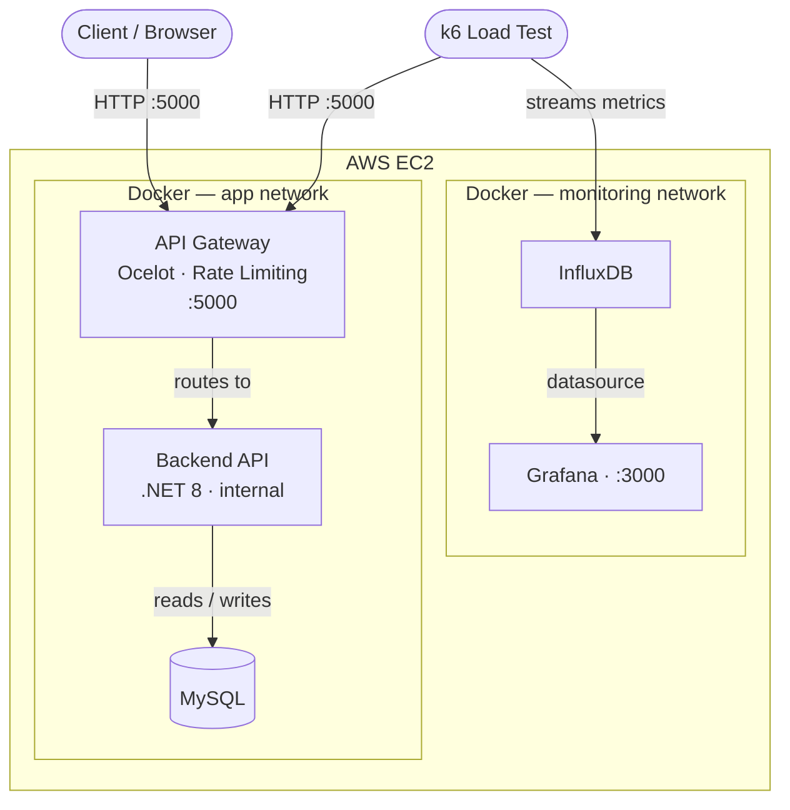

# Deployment Diagram

```mermaid
flowchart TD
    Client(["Client / Browser"])
    k6(["k6 Load Test"])

    subgraph EC2["AWS EC2"]
        subgraph AppNet["Docker — app network"]
            GW["API Gateway<br/>Ocelot · Rate Limiting<br/>:5000"]
            API["Backend API<br/>.NET 8 · internal"]
            DB[("MySQL")]
        end

        subgraph MonNet["Docker — monitoring network"]
            Influx["InfluxDB"]
            Grafana["Grafana · :3000"]
        end
    end

    Client -- "HTTP :5000" --> GW
    k6 -- "HTTP :5000" --> GW
    GW -- "routes to" --> API
    API -- "reads / writes" --> DB
    k6 -- "streams metrics" --> Influx
    Influx -- "datasource" --> Grafana
```
